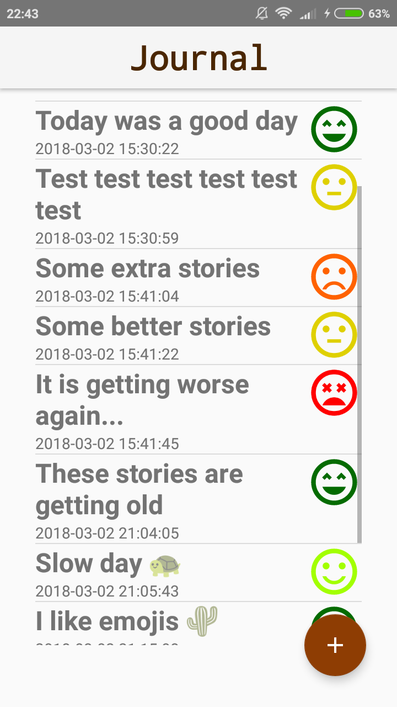
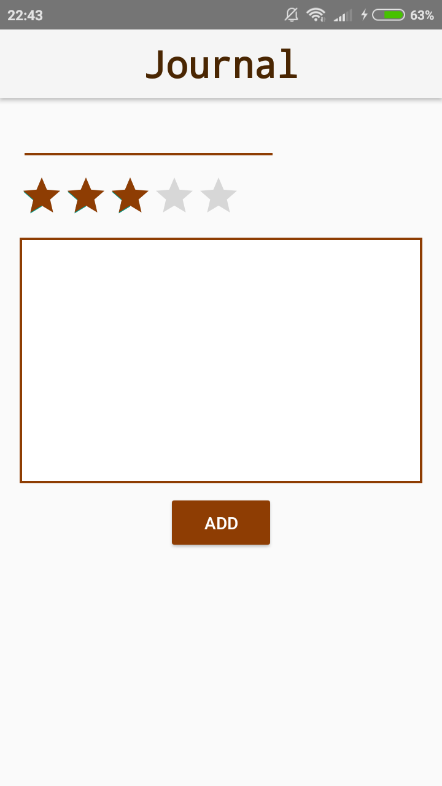
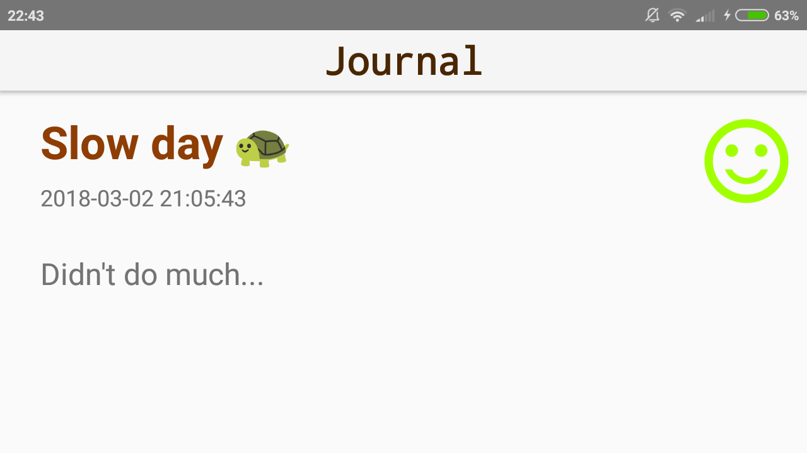

# Journal
pset4

Made by: Shankara van de Ven
         11000791

The Java exercises for the fourth week can be found here:
https://github.com/Shankaroe/Native-App-Java/tree/master/week4

This is the fourth app for the Native App Development course at the University of Amsterdam

